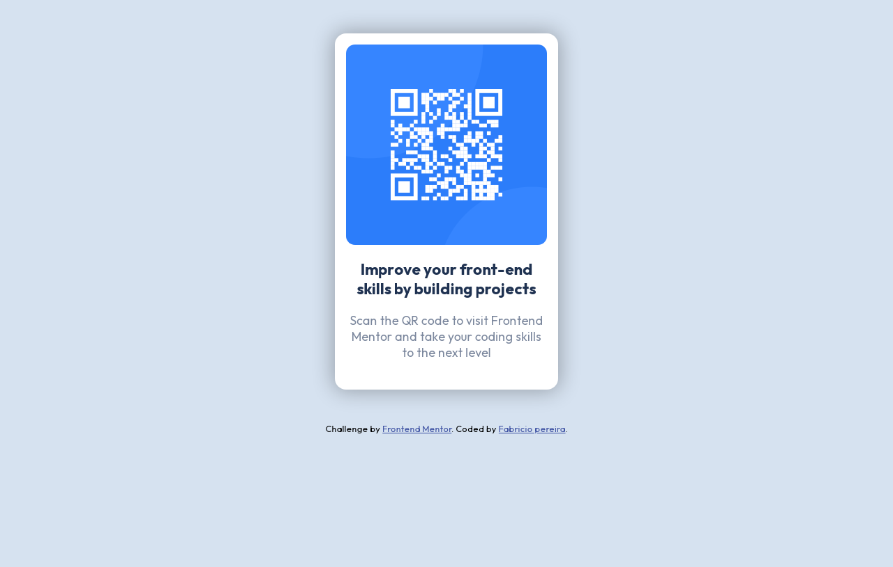

# QR-code-component 📱
Minha resolução do desafio [QR code component](https://www.frontendmentor.io/challenges/qr-code-component-iux_sIO_H) do [Frontend Mentor](https://www.frontendmentor.io/home).
## Link do projeto: https://fabricio-x.github.io/QR-code-component/

